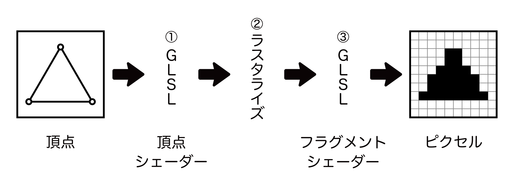
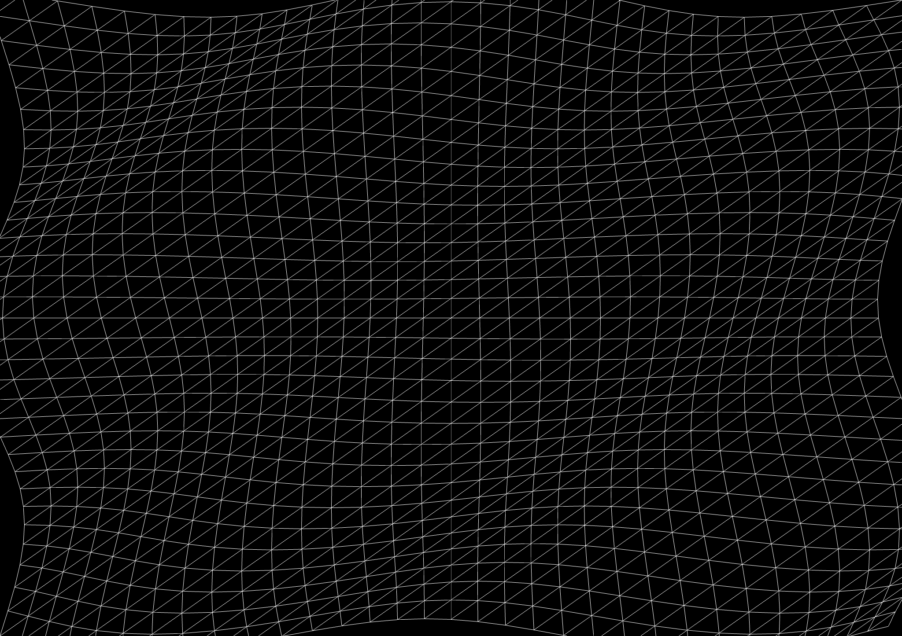
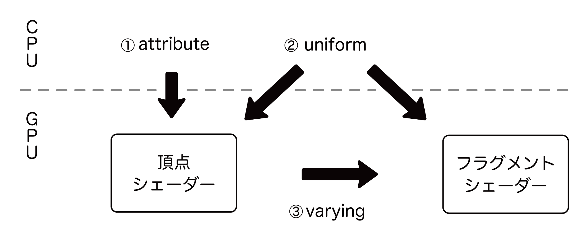
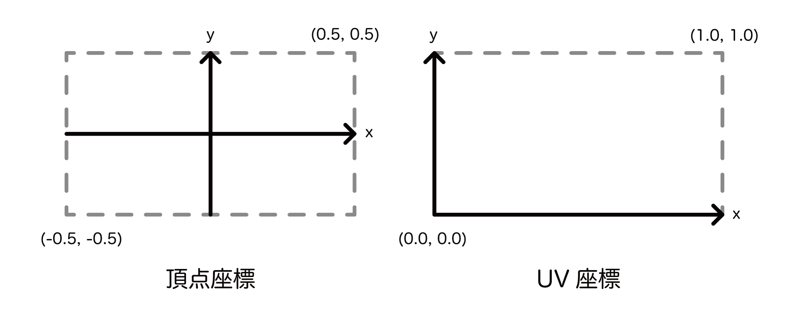
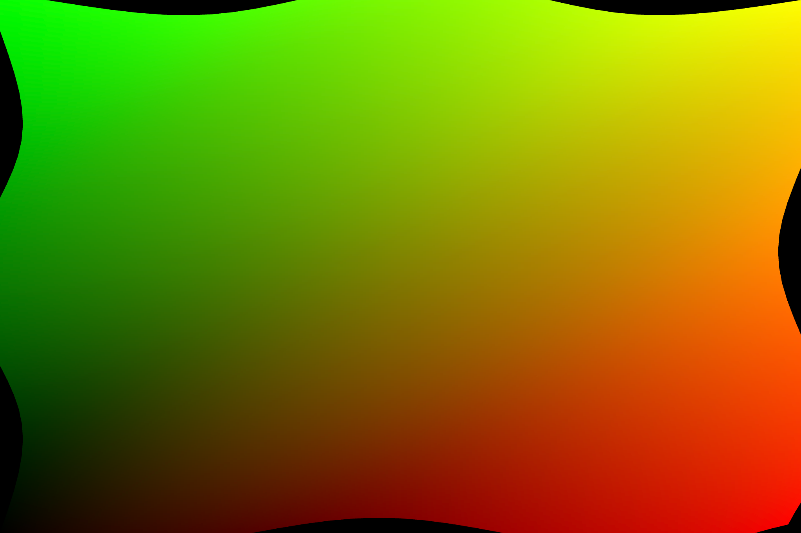

# Software Design 2023年7月号「three.jsでお手軽3Dプログラミング」

記事内で紹介しているサンプルコードです。

## 図：シェーダーの実行フロー

## 図：頂点シェーダーで変形させたメッシュ

## 図：uniform, attribute,  varying の関係

## 図：頂点座標とUV座標

## 図：シェーダーで変形とUV座標を表示したメッシュ
